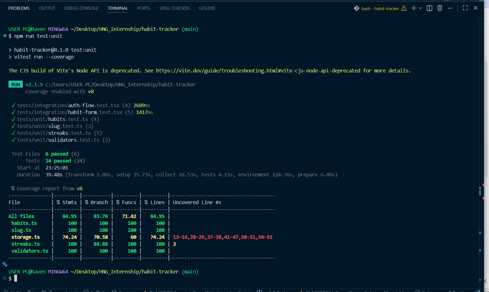

# Habit Tracker PWA

A mobile-first Progressive Web App for tracking daily habits and building streaks. Built with Next.js, React, TypeScript, and Tailwind CSS. All data persists locally via `localStorage`.

---

## Project Overview

This app lets users:
- Sign up, log in, and log out (local auth, no external service)
- Create, edit, and delete daily habits
- Mark habits complete for today (toggle)
- View a live current streak counter
- Install as a PWA and load the cached shell while offline

---

## Setup Instructions

### Prerequisites
- Node.js 18+
- npm 9+

### Install dependencies

```bash
npm install --legacy-peer-deps
```

---

## Run Instructions

### Development server

```bash
npm run dev
# App available at http://localhost:3000
```

### Production build

```bash
npm run build
npm run start
```

---

## Test Instructions

### Unit tests (with coverage report)

```bash
npm run test:unit
```

Runs all tests in `tests/unit/` and generates a coverage report for `src/lib/**`. Minimum threshold: **80% line coverage**.

### Integration / component tests

```bash
npm run test:integration
```

Runs all tests in `tests/unit/` and `tests/integration/`.

### End-to-end tests (requires running dev server)

```bash
# In one terminal:
npm run dev

# In another terminal:
npm run test:e2e
```

E2E tests use Playwright and run against `http://localhost:3000`.

### All tests

```bash
npm test
```

---

## Local Persistence Structure

All data is stored in `localStorage` using three keys:

### `habit-tracker-users`
JSON array of registered user objects:
```json
[
  {
    "id": "uuid",
    "email": "user@example.com",
    "password": "plaintext",
    "createdAt": "2024-06-15T10:00:00.000Z"
  }
]
```

### `habit-tracker-session`
Either `null` (no active session) or:
```json
{
  "userId": "uuid",
  "email": "user@example.com"
}
```

### `habit-tracker-habits`
JSON array of all habits across all users. Each habit belongs to a user via `userId`:
```json
[
  {
    "id": "uuid",
    "userId": "uuid",
    "name": "Drink Water",
    "description": "Stay hydrated",
    "frequency": "daily",
    "createdAt": "2024-06-15T10:00:00.000Z",
    "completions": ["2024-06-14", "2024-06-15"]
  }
]
```

`completions` contains unique ISO calendar dates (`YYYY-MM-DD`). The dashboard filters habits by `session.userId` so users only see their own data.

---

## PWA Implementation

### `public/manifest.json`
Declares the app as installable with `name`, `short_name`, `start_url: "/"`, `display: "standalone"`, `theme_color`, `background_color`, and icon paths for 192×192 and 512×512.

### `public/sw.js`
A network-first service worker that:
1. On `install`: caches the app shell routes (`/`, `/login`, `/signup`, `/dashboard`, `/manifest.json`)
2. On `fetch`: tries the network, caches successful responses, falls back to cache if offline
3. On `activate`: removes stale caches from previous versions

### Registration
`src/components/shared/ServiceWorkerRegister.tsx` is a client-only component rendered in the root layout that registers `/sw.js` on mount via `navigator.serviceWorker.register`.

---

## Trade-offs and Limitations

| Area | Decision | Reason |
|------|----------|--------|
| **Auth** | Plaintext passwords in localStorage | Stage requirement: no external auth. Do not use in production. |
| **Persistence** | localStorage only | Deterministic, testable, no backend required per spec |
| **Streaks** | Calculated client-side on render | Keeps state minimal; computed from `completions` array |
| **Offline** | App shell cached; data unavailable offline | localStorage is local anyway; no sync needed |
| **PWA icons** | Programmatically generated placeholders | Replace with proper branded icons before production |
| **Frequency** | Only `daily` implemented | Spec requires only daily for this stage |

---

## Test File Map

This section maps each required test file to the behavior it verifies.

### `tests/unit/slug.test.ts`
**Verifies**: `getHabitSlug()` from `src/lib/slug.ts`
- Converts habit names to lowercase hyphenated slugs used as `data-testid` identifiers
- Trims/collapses whitespace, removes non-alphanumeric characters, collapses consecutive hyphens

### `tests/unit/validators.test.ts`
**Verifies**: `validateHabitName()` from `src/lib/validators.ts`
- Rejects empty and whitespace-only names with `"Habit name is required"`
- Rejects names over 60 characters with appropriate message
- Returns trimmed value when valid

### `tests/unit/streaks.test.ts`
**Verifies**: `calculateCurrentStreak()` from `src/lib/streaks.ts`
- Returns 0 for empty completions or when today is not completed
- Counts consecutive days backward from today
- Deduplicates completions before counting
- Breaks streak when a calendar day is missing

### `tests/unit/habits.test.ts`
**Verifies**: `toggleHabitCompletion()` from `src/lib/habits.ts`
- Adds a date when not present, removes when already present
- Does not mutate the original habit object (returns new object)
- Deduplicates completions in the returned habit

### `tests/integration/auth-flow.test.tsx`
**Verifies**: `SignupForm` and `LoginForm` components
- Signup form creates a session in localStorage on success
- Duplicate email signup shows `"User already exists"` error
- Login form stores session on valid credentials
- Invalid login shows `"Invalid email or password"` error

### `tests/integration/habit-form.test.tsx`
**Verifies**: `HabitForm` and `HabitCard` components
- Empty habit name shows validation error before submitting
- Creating a habit via the form renders a card with slug-based `data-testid`
- Editing preserves immutable fields (`id`, `userId`, `createdAt`, `completions`)
- Delete requires explicit confirmation via `confirm-delete-button`
- Toggling completion updates the streak display immediately

### `tests/e2e/app.spec.ts`
**Verifies**: Full application flows in a real browser (Playwright)
- Splash screen visible at `/` before redirect
- Unauthenticated users redirected to `/login`
- Authenticated users redirected to `/dashboard` from `/`
- `/dashboard` is protected (redirects unauthenticated access)
- Full signup → dashboard flow
- Login loads only that user's habits (data isolation)
- Creating a habit from the dashboard
- Completing a habit updates the streak counter
- Session and habits persist after page reload
- Logout clears session and redirects to `/login`
- Cached app shell loads offline after first visit

## Coverage Report
